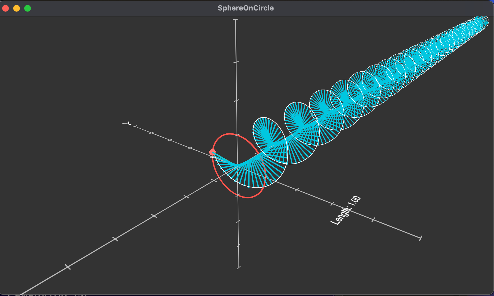
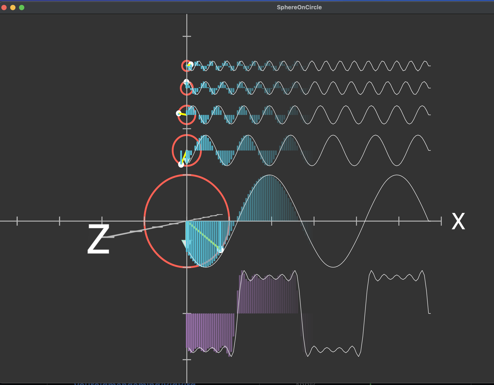
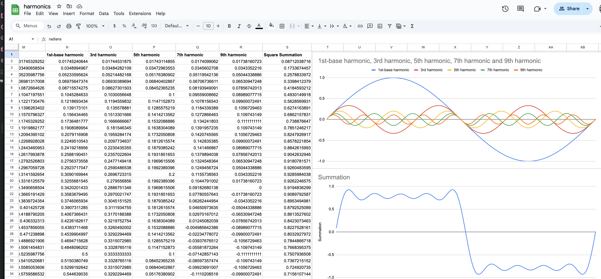
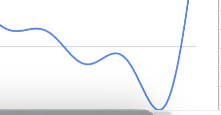

"I Ate Schrödinger's CAT!!!"

[]

# High-Level Roundup of the Coding Experiements

Exploring—waveforms, harmonics, and Fourier series—is at the heart of **signal processing**, **audio synthesis**, and even **quantum mechanics**.

---

## What has been done to date
1. **Patterns in Waveforms**:
   - Observed how simple circular motion (a ball moving around a circle) can generate sine waves, and how combining multiple sine waves (harmonics) can create more complex waveforms like square waves and sawtooth waves.
   - This is the foundation of **Fourier analysis**, which breaks down complex signals into simpler sine and cosine components.

2. **Harmonics and Overtones**:
   - By adding higher-frequency sine waves (harmonics) to a fundamental frequency, you can shape the resulting waveform. This is how musical instruments create their unique sounds—each instrument has a distinct mix of harmonics.

[]

3. **Visualizing Math**:
   - Using tools like Manim, you’re able to visualize abstract mathematical concepts in a way that makes them intuitive and engaging. This is a superpower for understanding and communicating complex ideas.

[]
[]
---

## Why This is Fascinating

- **Universality of Sine Waves**:
  - Sine waves are the building blocks of all periodic signals. Whether it’s sound, light, or quantum wavefunctions, sine waves are everywhere.
- **From Simple to Complex**:
  - Starting with something as simple as a circle, you can build up to incredibly complex waveforms and systems. This is a great example of how simplicity underlies complexity.
- **Creative Coding**:
  - By combining math, physics, and programming, you’re able to create animations and simulations that bring abstract ideas to life. 

This is where art and science meet!

---

## Where We Can Go From Here

### 1. Explore More Waveforms
   - Try generating other waveforms, like triangle waves, pulse waves, or even custom shapes.
   - Experiment with different combinations of harmonics to see how they affect the waveform.

### 2. Fourier Transform
   - Dive into the **Fourier transform**, which generalizes the idea of breaking down signals into sine waves. This is used everywhere, from audio processing to image compression.
   - Visualize how a Fourier transform decomposes a signal into its frequency components.

### 3. Audio Synthesis
   - Use your knowledge of waveforms and harmonics to create simple audio synthesizers. For example, you could generate musical notes or sound effects using Python libraries like `pyaudio` or `simpleaudio`.

### 4. Quantum Mechanics
   - Explore how wavefunctions in quantum mechanics are described using sine waves and complex exponentials. You could visualize the wavefunction of a particle in a box or a harmonic oscillator.

### 5. Interactive Visualizations
   - Create interactive tools where users can adjust the number of harmonics, frequencies, and amplitudes to see how the waveform changes in real time. Libraries like `matplotlib` or `manim` can help with this.

### 6. Physical Simulations
   - Simulate physical systems that involve waves, like a vibrating string, a pendulum, or water waves. This will deepen your understanding of how waves behave in the real world.

---

Building the base visualisation of a sine wave generation. Notice no reliance of Math libraries, all hard numbers. Based on xls modelling included!!!

3D Sine Wave [YouTube](https://youtu.be/YlmWVUL-KwY)

Or watch it on [YouTube](https://youtu.be/wXhSkg9iTU8).

Run Code

manimgl sphere_on_circle.py SphereOnCircle 

Create Video
manimgl -w --uhd sphere_on_circle.py SphereOnCircle

or

ffmpeg -i SphereOnCircle.mp4 -vf "fps=60,scale=640:-1:flags=lanczos" -c:v pam -f image2pipe - | convert -delay 5 -loop 0 - sphere_animation.gif

